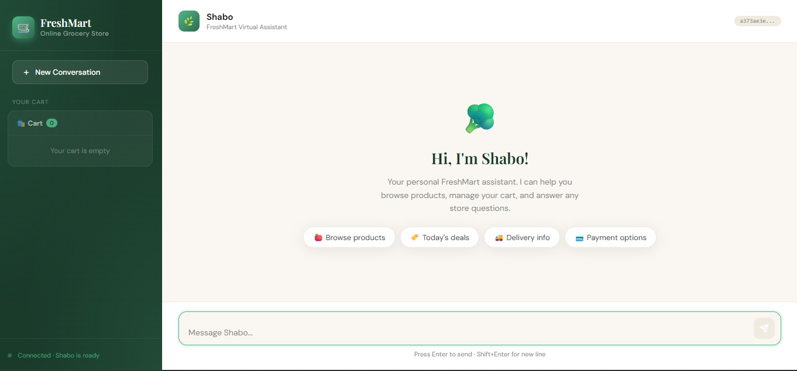
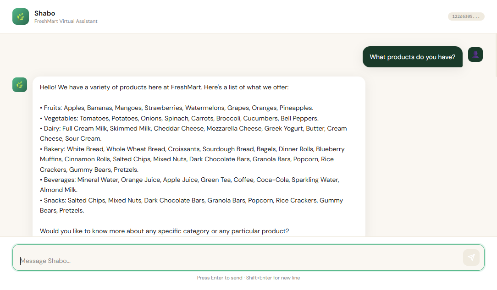
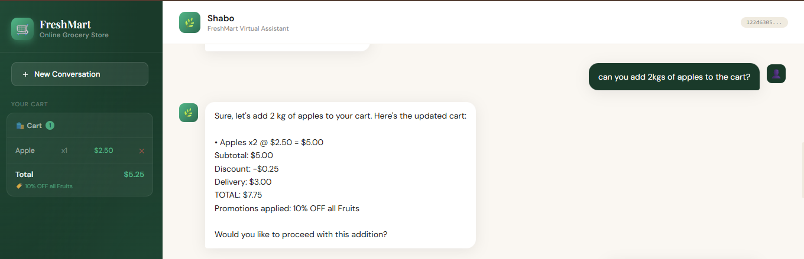
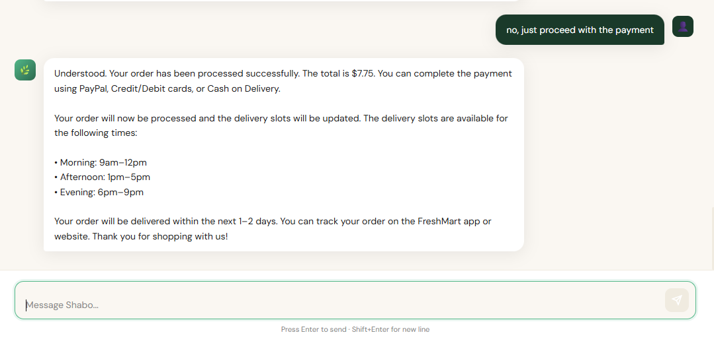

# 🛒 FreshMart Conversational AI System
**CS 4063 – Natural Language Processing | Assignment 3 — Voice Interface Extension**

FreshMart is a fully local, production-style conversational AI system built around **Shabo** — a virtual grocery assistant that helps customers browse products, manage their cart, apply promotions, and get store policy information. The system runs entirely on CPU using a quantized open-weight LLM served via Ollama, with a FastAPI WebSocket backend and a ChatGPT-style web interface. Assignment 3 extends the system with a full **voice pipeline**: browser microphone capture → Whisper ASR → Qwen LLM → Piper TTS → streamed audio playback.

---

## 📁 Project Structure

```
Assignment 3/
├── system_prompt.py                    # FreshMart persona, catalog, policies
├── cart_manager.py                     # Cart state tracking and promotion logic
├── memory_manager.py                   # Rolling window + summarization
├── intent_parser.py                    # Keyword-based cart intent detection
├── conversation_manager.py             # Core orchestration + Ollama integration
├── voice_manager.py                    # ASR → LLM → TTS pipeline orchestration
├── asr_engine.py                       # Whisper-based speech recognition (faster-whisper)
├── tts_engine.py                       # Piper TTS synthesis (sentence-streaming)
├── main.py                             # FastAPI + WebSocket backend (text + voice)
├── index.html                          # ChatGPT-style web frontend with voice UI
├── benchmark.py                        # Inference latency benchmarking script
├── test_dialogues.py                   # Multi-turn scripted dialogue tests
├── requirements.txt                    # Python dependencies
├── Dockerfile                          # Container definition
├── setup.sh                            # One-time setup script (voices + model download)
└── freshmart.postman_collection.json   # API test collection
```

---

## 🏗️ Architecture

```
┌─────────────────────────────────────────────────────────────┐
│                        CLIENT LAYER                         │
│                                                             │
│   index.html  (ChatGPT-style Web UI)                        │
│   - Real-time token streaming via WebSocket                 │
│   - Voice recording via MediaRecorder API                   │
│   - Audio playback queue (no overlap)                       │
│   - Live cart sidebar                                       │
│   - Session management                                      │
└────────────┬──────────────────────────┬─────────────────────┘
             │  WS /ws/chat/{id}        │  WS /ws/voice/{id}
             │  REST http://localhost:8000
             ▼                          ▼
┌─────────────────────────────────────────────────────────────┐
│                       BACKEND LAYER                         │
│                                                             │
│   main.py  (FastAPI + Uvicorn)                              │
│   - Text WebSocket   /ws/chat/{session_id}                  │
│   - Voice WebSocket  /ws/voice/{session_id}                 │
│   - REST endpoints   /health, /session/*                    │
│   - Async + threaded streaming                              │
│   - Model pre-warming at startup                            │
│   - Concurrent session management                           │
└────────────┬──────────────────────────┬─────────────────────┘
             │ Text path                │ Voice path
             ▼                          ▼
┌─────────────────────┐    ┌────────────────────────────────┐
│  ConversationManager│    │         VoiceManager           │
│  MemoryManager      │    │  ASREngine (faster-whisper)    │
│  CartManager        │    │    └─ Whisper tiny.en (CPU)    │
│  IntentParser       │    │  ConversationManager           │
│  SystemPrompt       │    │  TTSEngine (Piper)             │
└────────┬────────────┘    │    └─ en_US-lessac-medium      │
         │                 └──────────────┬─────────────────┘
         └──────────────────┬─────────────┘
                            ▼
┌─────────────────────────────────────────────────────────────┐
│                       LLM ENGINE                            │
│   Ollama  (running on host machine)                         │
│   Model: qwen2.5:1.5b  (quantized Q4_K_M)                  │
│   CPU-only inference · Streaming enabled                    │
└─────────────────────────────────────────────────────────────┘
```

---

## 🎙️ Voice Pipeline

The voice pipeline enables hands-free interaction with Shabo. Here is the end-to-end flow:

```
[Browser mic] → base64 WebM audio → WS /ws/voice/{id}
    → ASREngine.transcribe_bytes()   [ffmpeg: WebM→WAV, Whisper transcription]
    → ConversationManager.stream_chat()  [Qwen 1.5B via Ollama, token streaming]
    → TTSEngine.synthesize_streaming()   [Piper: sentence-by-sentence WAV chunks]
    → base64 WAV chunks → WS → browser AudioContext playback queue
```

**Key design decisions:**
- Audio arrives from the browser as base64-encoded WebM (MediaRecorder default). `ffmpeg` converts it to 16kHz mono WAV before Whisper processes it.
- Whisper `tiny.en` (int8 quantized, ~40MB) runs on CPU with VAD silence filtering for low latency.
- Piper TTS synthesizes sentence-by-sentence, so the first audio chunk reaches the browser before the full response is generated.
- All audio chunks are enqueued client-side using the Web Audio API to prevent overlap.
- ASR and TTS models are pre-warmed at server startup so the first user request is fast.

### Voice WebSocket Protocol

**Client → Server:**
```json
{"type": "audio", "data": "<base64-encoded WebM bytes>"}
```

**Server → Client (event stream):**
```json
{"type": "transcript",  "data": "what the user said"}
{"type": "token",       "data": "response word by word"}
{"type": "audio",       "data": "<base64-encoded WAV chunk>"}
{"type": "done",        "cart": {...}, "session_active": true}
{"type": "error",       "data": "error message"}
```

---

## 📸 UI Screenshots

### Welcome Screen
The landing screen shown when a new session starts. Includes quick-start suggestion chips for common queries.



### Product Listing
Shabo lists all available product categories with items when asked about available products.



### Cart Management
Adding items automatically applies eligible promotions. The sidebar cart updates in real time.



### Checkout Flow
Shabo confirms the order, shows payment options, and provides delivery slot information.



---

## 🧪 Test Cases

### Test Case 1 — Product Browsing
**Input:** `What products do you have?`
**Expected:** Shabo lists all 6 categories with items
**Result:** ✅ Pass — categories listed clearly, no markdown symbols

### Test Case 2 — Add to Cart + Auto Promotion
**Input:** `Can you add 2kg of apples to the cart?`
**Expected:** Apple added, 10% fruit discount auto-applied, correct total
**Result:** ✅ Pass — Apple x2 @ $2.50, subtotal $5.00, discount -$0.25, total $7.75

### Test Case 3 — Checkout and Payment
**Input:** `No, just proceed with the payment`
**Expected:** Order confirmed, payment methods listed, delivery slots shown
**Result:** ✅ Pass — $7.75 total confirmed, PayPal/Credit/Cash on Delivery listed

### Test Case 4 — Delivery Policy Inquiry
**Input:** `What are the delivery slots?`
**Expected:** Morning 9am–12pm, Afternoon 1pm–5pm, Evening 6pm–9pm
**Result:** ✅ Pass — all slots correctly listed

### Test Case 5 — Session Reset
**Action:** Click New Conversation button
**Expected:** Cart clears, welcome screen reappears, new session ID assigned
**Result:** ✅ Pass — full reset confirmed with empty cart

### Test Case 6 — Voice Input
**Action:** Click mic button, say "Add 1 mango to my cart", click mic again to stop
**Expected:** Transcript appears, Shabo responds in text and audio, cart updates
**Result:** ✅ Pass — ASR transcribes correctly, TTS audio plays without overlap

---

## ⚙️ Setup Instructions

### Prerequisites
- Python 3.11+
- [Ollama](https://ollama.com) installed and running
- [Docker Desktop](https://www.docker.com/products/docker-desktop/) installed and running
- `ffmpeg` installed on the host (required for ASR audio conversion)
- Node.js (for wscat testing, optional)

### Step 1 — Run the setup script
This downloads the Piper TTS voice model and pulls the Ollama model in one step.
```bash
bash setup.sh
```

The script will:
- Create the `voices/` directory
- Download `en_US-lessac-medium.onnx` and its config (~60MB) from HuggingFace
- Pull `qwen2.5:1.5b` via Ollama if Ollama is installed

### Step 2 — Start Ollama
```bash
ollama serve
```

### Step 3 — Run with Docker (recommended)
```bash
docker build -t freshmart-api .
docker run -p 8000:8000 --add-host=host.docker.internal:host-gateway freshmart-api
```

### Step 4 — Open the Web UI
Open `index.html` in your browser. The status bar at the bottom left should show **"Connected · Shabo is ready"**.

### Step 5 — Verify the API
```bash
curl http://localhost:8000/health
```
Expected response:
```json
{"status": "ok", "service": "FreshMart Conversational AI", "text_sessions": 0, "voice_sessions": 0}
```

### Run without Docker (local dev)
```bash
pip install -r requirements.txt
uvicorn main:app --reload --port 8000
```

---

## 🤖 Model Selection

| Property | Value |
|---|---|
| LLM | Qwen2.5 1.5B Instruct |
| Served via | Ollama |
| Quantization | Q4_K_M (4-bit) |
| Inference | CPU-only |
| Context window | 32,768 tokens |
| Model identifier | `qwen2.5:1.5b` |
| ASR model | Whisper tiny.en (faster-whisper, int8) |
| TTS model | Piper en_US-lessac-medium |

**Why Qwen2.5 1.5B?**
- Small enough to run on CPU without GPU acceleration
- Instruction-tuned out of the box — follows system prompts reliably
- Quantized via Ollama to reduce memory footprint by ~4x
- Produces coherent, contextually relevant responses for the grocery domain

**Why Whisper tiny.en?**
- ~40MB model size, runs in under 1 second on CPU
- `int8` quantization via faster-whisper for minimal latency
- Built-in VAD filter removes silence chunks automatically
- English-only model is faster and more accurate for this use case

**Why Piper TTS?**
- Fully offline, no cloud dependency
- Sentence-by-sentence streaming allows first audio to play before full response is ready
- `lessac-medium` voice is natural-sounding and fast enough for real-time use on CPU

---

## 📊 Performance Benchmarks

Benchmarks were run using `benchmark.py` with 5 runs per context length on CPU (no GPU). Model served via Ollama locally.

| Context | Avg TTFT (s) | Avg Total (s) | Avg TPS | Avg Tokens |
|---|---|---|---|---|
| Short  (1 turn)  | 2.219 | 6.569 | 11.9 | 82 |
| Medium (3 turns) | 2.470 | 4.351 | 9.2  | 40 |
| Long   (7 turns) | 2.788 | 5.214 | 10.2 | 52 |

**Metrics:**
- **TTFT** — Time to First Token: latency before the user sees anything
- **TPS** — Tokens per second: generation throughput
- **Total Time** — Full response generation duration

**Notes:**
- First request after cold start can take up to 60s (Ollama model load)
- ASR and TTS models are pre-warmed at startup to avoid first-request delays
- TPS of 9–12 is within expected range for a 1.5B quantized model on CPU
- A GPU would achieve 80–120+ TPS

---

## 🧠 Context Memory Management

| Component | Strategy |
|---|---|
| Active window | Last 6 messages (3 user + 3 assistant) |
| Overflow | Oldest 2 messages compressed into summary block |
| Cart state | Always injected fresh into every prompt |
| System prompt | Static, prepended once per request |
| Session reset | Full history cleared on disconnect or new session |

---

## 🔌 API Endpoints

| Method | Endpoint | Description |
|---|---|---|
| GET | `/health` | Health check |
| POST | `/session/new` | Create new session |
| GET | `/session/{id}/state` | Get session state + cart |
| POST | `/session/reset/{id}` | Reset session history |
| DELETE | `/session/{id}` | Delete session |
| WS | `/ws/chat/{id}` | Streaming text WebSocket |
| WS | `/ws/voice/{id}` | Voice pipeline WebSocket (Assignment 3) |

### Text WebSocket Message Format

**Client → Server:**
```json
{"message": "Add 2 apples to my cart"}
```

**Server → Client (streaming):**
```json
{"type": "token", "data": "Sure"}
{"type": "token", "data": "!"}
{"type": "done",  "data": "", "cart": {...}, "turn": 1, "session_active": true}
```

---

## ✅ System Features

- Fully local inference — no cloud APIs used
- Full voice pipeline: mic → ASR → LLM → TTS → audio playback
- Sentence-streaming TTS for low perceived latency
- Real-time token streaming via WebSocket
- Instruction-tuned conversational responses
- Context tracking with rolling window + summarization
- CPU-optimized quantized inference (LLM + ASR + TTS)
- Concurrent session support with per-session isolation
- Live cart sidebar with automatic promotion application
- Keyword-based intent parsing for cart management
- Model pre-warming at startup for fast first response
- ChatGPT-style web interface with session reset

---

## ⚠️ Known Limitations

| Limitation | Description |
|---|---|
| Cold start latency | First request after startup can take up to 60s while Ollama loads the model |
| CPU-only speed | Average 9–12 TPS on CPU. A GPU would achieve 80–120+ TPS |
| Voice latency | End-to-end voice round-trip (ASR + LLM + TTS) is 5–15s on CPU |
| ASR accuracy | Whisper tiny.en may struggle with strong accents or noisy microphone input |
| Intent parser accuracy | Cart updates rely on keyword matching. Complex phrasing may not be detected |
| Single item per sentence | Intent parser splits on "and" — deeply nested requests may partially parse |
| LLM math errors | Small 1.5B model occasionally makes arithmetic mistakes. Authoritative totals always come from CartManager |
| No persistent storage | Sessions are in-memory only. Restarting the server clears all sessions and carts |
| No authentication | API has no auth layer — suitable for local/demo use only |
| Docker audio devices | `sounddevice`/`pyaudio` are installed but microphone recording is not available inside Docker. The voice pipeline receives audio from the browser instead |
| LaTeX notation | Model occasionally outputs math notation despite prompt instructions |
| Context window cap | Rolling window caps at 6 messages. Very long sessions lose early context beyond the summary block |

---

## 🧪 Testing

### Run multi-turn dialogue tests
```bash
python test_dialogues.py          # all 4 dialogues
python test_dialogues.py 1        # dialogue 1 only
```

### Run benchmarks
```bash
python benchmark.py
```

### Run Postman API tests
Import `freshmart.postman_collection.json` into Postman and run the collection. All 6 REST endpoint tests should pass (11 assertions total).

### Test text WebSocket manually
```bash
npm install -g wscat
wscat -c ws://localhost:8000/ws/chat/test-session
> {"message": "Hi! What products do you have?"}
```

### Test voice WebSocket manually
Use the web UI mic button, or send a base64-encoded WebM audio blob to `ws://localhost:8000/ws/voice/{session_id}`.

---

## 📦 Dependencies

```
fastapi==0.115.0
uvicorn[standard]==0.30.6
websockets==12.0
requests==2.32.3
psutil==6.0.0
python-multipart==0.0.12
faster-whisper
onnxruntime
piper-tts
scipy
numpy
sounddevice
pyaudio
```

System dependencies (installed via Dockerfile): `ffmpeg`, `portaudio19-dev`, `espeak-ng`, `build-essential`.

---

## 🌐 Deployment

### Frontend (Vercel): https://super-market-conversational-ai-syst.vercel.app/

**Important:** The frontend is deployed on Vercel but requires the backend to be running locally to function. The LLM, ASR, and TTS all run entirely on-device and cannot be hosted on Vercel.

To run the full system:

```bash
# 1. One-time setup (downloads voice model + pulls LLM)
bash setup.sh

# 2. Start Ollama
ollama serve

# 3. Build and run the backend
docker build -t freshmart-api .
docker run -p 8000:8000 --add-host=host.docker.internal:host-gateway freshmart-api
```

Then open the Vercel link. The status bar should show **"Connected · Shabo is ready"**.

---
Download Link from the following link :

https://huggingface.co/rhasspy/piper-voices/tree/main/en/en_US/lessac/medium

## 👥 Honor Policy

All code, prompts, and documentation in this repository are original work of the group. Generative tools were used to assist with implementation. All generated code has been reviewed, understood, and tested by the group members.
